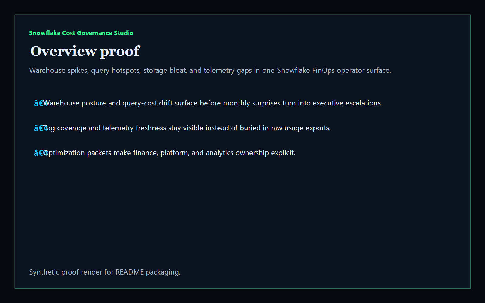
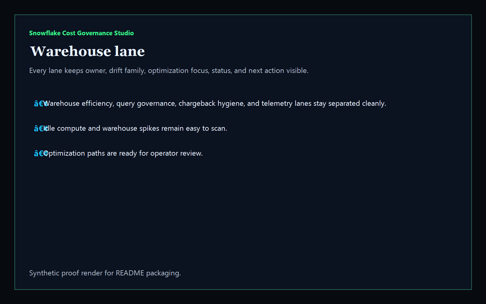
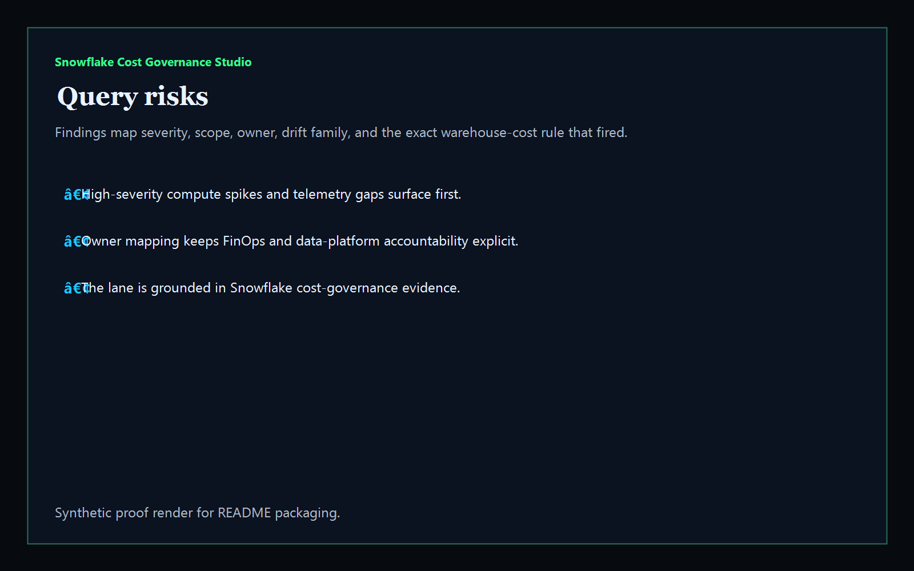
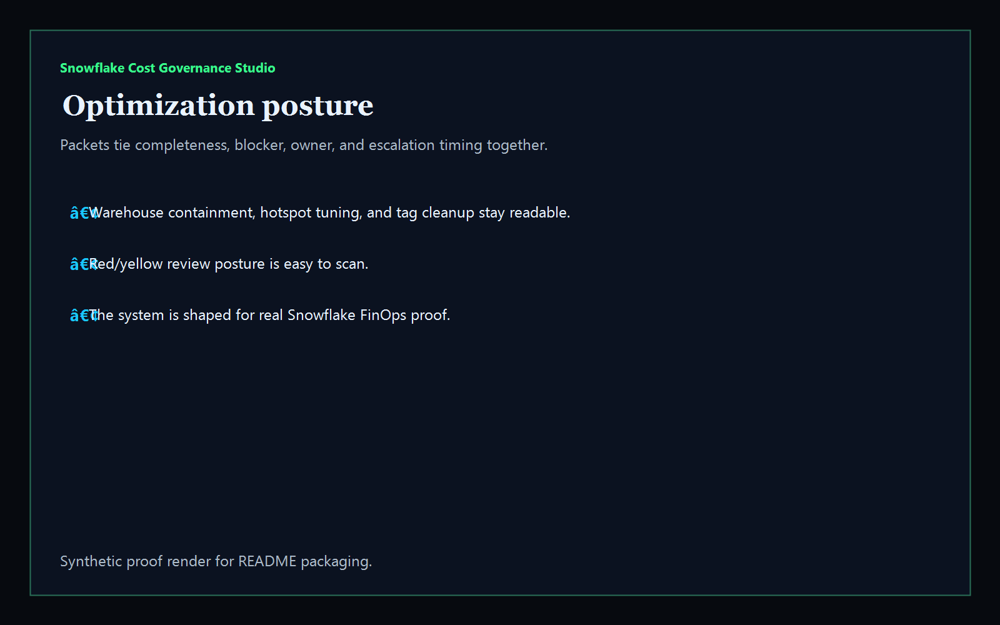

# snowflake-cost-governance-studio

[](https://github.com/mizcausevic-dev/snowflake-cost-governance-studio/actions/workflows/ci.yml)
[](https://github.com/mizcausevic-dev/snowflake-cost-governance-studio/actions/workflows/pages.yml)

Operator control plane for Snowflake warehouse cost posture, query hotspots, tag-coverage drift, telemetry gaps, storage bloat, and optimization sequencing.

## Production status

| Aspect | Status |
|--------|--------|
| Deploy | Static prerender -> **https://warehouse.kineticgain.com/** |
| Data posture | Synthetic warehouse-spend and optimization-export samples only; no tenant identifiers, account locators, or live usage data are committed |

## Why this matters

- Snowflake spend gets dangerous when warehouse spikes, idle compute, and hotspot queries stay trapped in raw usage exports instead of one operator-readable surface.
- Recruiters looking for `Snowflake / FinOps / warehouse cost / data platform` proof should see a real operator dashboard, not a keyword page.
- This repo turns Snowflake usage and optimization drift into a control plane for compute containment, chargeback hygiene, telemetry continuity, and warehouse-rightsizing posture.

## Why this matters (KG Embedded tie-back)

This repo demonstrates the warehouse-cost and optimization-control-plane primitive for Kinetic Gain Embedded: account snapshots, query-cost evidence, tagging hygiene, and optimization packets in one operator surface. Kinetic Gain Embedded extends this pattern into productized in-app dashboards where platform, FinOps, and finance teams need evidence-rich cost governance without exposing raw admin consoles or live warehouse credentials.

## What it shows

- `warehouse-lane` visibility for compute spikes, idle warehouses, chargeback hygiene, and telemetry continuity
- `query-risks` detection for hotspot workloads, stale snapshots, storage bloat, missing tags, and optimization windows
- `optimization-posture` packets that tie owner, blocker, timing, and completeness together
- offline-safe analysis of captured Snowflake usage exports
- recruiter-facing Snowflake / FinOps / data-platform proof that complements the Microsoft, AWS, GCP, and reporting lanes

## Routes

- `/`
- `/warehouse-lane`
- `/query-risks`
- `/optimization-posture`
- `/verification`
- `/docs`

## API

- `/api/dashboard/summary`
- `/api/warehouse-lane`
- `/api/query-risks`
- `/api/optimization-posture`
- `/api/verification`
- `/api/sample`

## Screenshots






## CLI

```powershell
npx snowflake-cost-governance fixtures/snowflake-cost-hotspots.json `
  --format markdown `
  --fail-on-high
```

## Validation

- `npm run verify`
- `npm run prerender`
- `npm run render:assets`

## Local development

```powershell
cd snowflake-cost-governance-studio
npm install
npm run dev
```

Then open:

- [http://127.0.0.1:5523/](http://127.0.0.1:5523/)
- [http://127.0.0.1:5523/warehouse-lane](http://127.0.0.1:5523/warehouse-lane)
- [http://127.0.0.1:5523/query-risks](http://127.0.0.1:5523/query-risks)
- [http://127.0.0.1:5523/optimization-posture](http://127.0.0.1:5523/optimization-posture)

## Packaging

| Item | Value |
|---|---|
| License | `AGPL-3.0-or-later` |
| CNAME | `warehouse.kineticgain.com` |
| Live site | [https://warehouse.kineticgain.com/](https://warehouse.kineticgain.com/) |
| Deploy | Static prerender -> GitHub Pages |

## Docs

- [docs/KINETIC_GAIN_EMBEDDED.md](./docs/KINETIC_GAIN_EMBEDDED.md)

## Related

- [**`gcp-billing-anomaly-router`**](https://github.com/mizcausevic-dev/gcp-billing-anomaly-router) — GCP cost anomaly routing lane
- [**`regulatory-reporting-mart`**](https://github.com/mizcausevic-dev/regulatory-reporting-mart) — reporting and warehouse proof
- [**`capacity-optimizer-jl`**](https://github.com/mizcausevic-dev/capacity-optimizer-jl) — optimization and scenario planning
